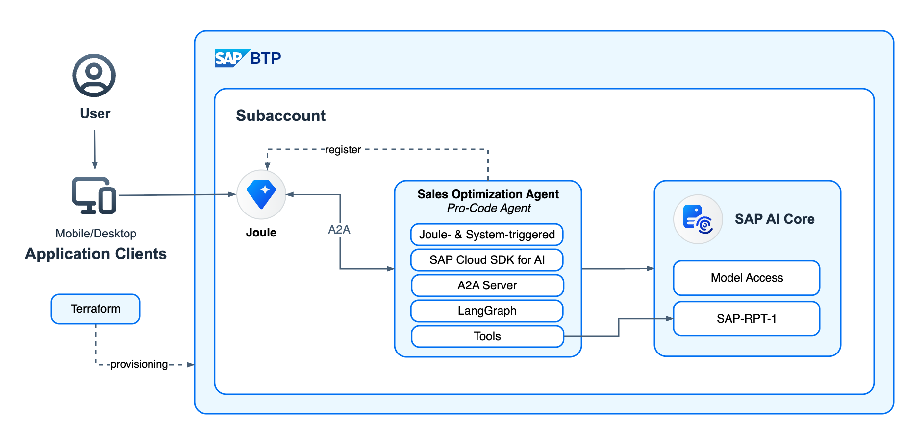
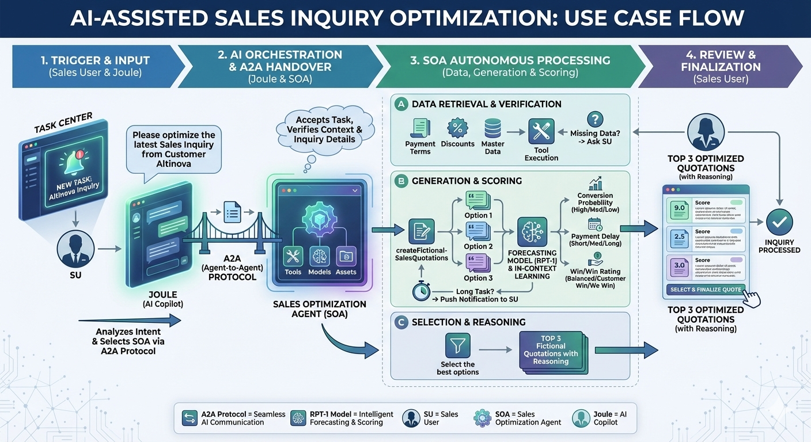
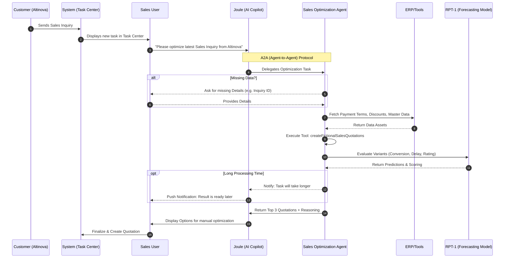

# Reference Implementation for A2A-Compliant Pro-Code Agents on SAP BTP with Joule Integration

Modular reference implementation covering a full-fledged agentic scenario end to end including Joule Integration via the A2A Protocol.

## 📖 Introduction & Purpose

This repository serves as a **reference implementation** for building enterprise-grade, "Pro-Code" Agents on the SAP Business Technology Platform (BTP). It demonstrates a modular, full-fledged agentic scenario from end-to-end, adhering to best practices for BTP development.

The primary goals of this project are:

* **A2A Compliance:** Implementing [Agent-to-Agent (A2A) Protocol](https://a2a-protocol.org/latest/) compliant agents ("3rd Party Agents") to set scope, identify specification gaps, and contribute upstream fixes.
* **Joule Integration:** Facilitating outbound A2A integration where **Joule** acts as the client for BTP-hosted or remotely hosted 3rd party agents.

## 🏗️ Architecture

This simplified architecture is enhanced with access to RPT-1 as a tool and is based on reference architectures from the SAP Architecture Center: [Integrating AI Agents with Joule](https://architecture.learning.sap.com/docs/ref-arch/ca1d2a3e/4) and [Pro-Code AI Agents on SAP BTP](https://architecture.learning.sap.com/docs/ref-arch/ca1d2a3e/3).

## ✨ Features

The project features are organized by status, ranging from core A2A compliance to advanced integrations.

| Feature / Module | Status | Description |
| --- | --- | --- |
| **A2A-Compliant Agent** | ✅ **Done** | Full implementation of the A2A protocol specifications, capable of handling complex agentic workflows. |
| **Pro-Code AI Agent Implementation** | ✅ **Done** | Built using **LangGraph** (TypeScript) on **CAP**, integrated with the **SAP Cloud SDK for AI** to access models via the Generative AI Hub. Includes Human-in-the-Loop patterns. |
| **Joule Integration (A2A)** | ✅ **Done** | Integration into Joule via the A2A protocol |
| **Asynchronous Communication** | ✅ **Done** | Implementation of **Webhooks** for A2A PushNotifications. Includes a WebSocket-based server and React UI to visualize status updates as they arrive. |
| **Extension Sample** | ✅ **Done** | Examples of custom logic extensions (e.g., mocking responses) to bypass LLM generation for testing or specific logic handling. |
| **Advanced Forecasting** | ✅ **Done** | Leveraging **SAP-RPT-1** to run use cases like forecasting (e.g., Payment Delay, New Product Introduction) or simulation. |
| **Infrastructure as Code** | ✅ **Done** | Full E2E setup via **Terraform**. |

## 🛠️ Tech Stack & References

* **Infrastructure**:
    - [SAP Business Technology Platform](https://www.sap.com/germany/products/technology-platform.html)
    - [Cloud Foundry](https://help.sap.com/docs/btp/sap-business-technology-platform/cloud-foundry-environment)
    - [Generative AI Hub in SAP's AI Foundation](https://www.sap.com/germany/products/artificial-intelligence/generative-ai-hub.html)
* **Frameworks:**
    - [SAP Cloud Application Programming Model (CAP)](https://cap.cloud.sap/docs/)
    - [LangGraph JS](https://docs.langchain.com/oss/javascript/langgraph/overview) (Agent Framework)
* **Protocol:** [A2A Protocol Spec](https://a2a-protocol.org/latest/)
* **SDKs:**
    - [SAP Cloud SDK for AI](https://sap.github.io/ai-sdk/docs/js/overview-cloud-sdk-for-ai-js)
    - [A2A JavaScript SDK](https://github.com/a2aproject/a2a-js)

## 📂 Project Structure

The repository is organized into modular components to simulate a distributed agent environment:

| Directory | Description |
| :--- | :--- |
| [**`a2a-agent`**](./a2a-agent/README.md) | The core Pro-Code Agent. • Written in **TypeScript** on **CAP**. • Uses **LangGraph** for agent logic. • **A2A Compliant**. • Connects to Generative AI Hub via SAP Cloud SDK for AI. |
| [**`joule-integration`**](./joule-integration/README.md) | Connecting **Joule** via the A2A protocol to the `a2a-agent` using action type [`agent-request`](./joule-integration/sales-optimization-agent/functions/call_agent.yaml#L12-L19). |
| [**`webhook-server`**](./webhook-server/README.md) | A WebSocket-based CAP server for handling A2A PushNotifications. • **Backend (CAP):** Receives `StatusUpdates` from the agent. • **Frontend (React.js):** Displays incoming status updates live. |
| [**`terraform`**](./terraform/README.md) | **Infrastructure as Code** for full E2E BTP setup. • Provisions subaccount, Cloud Foundry, IAS trust, Joule, AI Core, HANA, and all service bindings. • Uses **SAP BTP**, **Cloud Foundry**, and **SCI** Terraform providers. |

## 🚦 Getting Started

- [Local Setup](./a2a-agent/README.md)
- [Infrastructure Setup (Terraform)](./terraform/README.mdt)
- [Deployment to Cloud Foundry](./a2a-agent/README.md#10-deployment-to-cloud-foundry)
- [Joule Integration](./joule-integration/README.md)

## 💡 Use Case: AI-Assisted Sales Inquiry Optimization

### User Story

> **As a** Sales User at BestRun,
> **I want to** use the Joule AI Copilot to automatically analyze, generate, and score optimized sales quotation options for incoming customer inquiries,
> **So that** I can maximize the sales conversion probability, balance profitability, and respond to customers (like Altinova) faster with the best possible terms.

#### Acceptance Criteria

* The Sales User can trigger the optimization directly from the Task Center via Joule.
* Joule must automatically identify and delegate the request to the specific **Sales Optimization Agent (SOA)** via A2A protocol.
* The SOA must auto-retrieve necessary data (Payment Terms, Discounts) and generate multiple fictional sales quotations.
* The system must use the **RPT-1 forecasting model** to score these quotations based on Conversion Probability, Payment Delay, and a "Win/Win" rating.
* The user is presented with the **Top 3** distinct quotation options with reasoning for manual finalization.

---

### Use Case Specification

**Use Case Name:** Optimize Sales Inquiry via Agent-to-Agent (A2A) Delegation

#### Actors
* **Sales User (SU)**
* **Joule:** The AI Assistant.
* **Sales Optimization Agent (SOA):** The backend autonomous agent.
* **Customer (Altinova):** Trigger entity (sender of inquiry).

#### Preconditions

1. A new Sales Inquiry from Customer "Altinova" exists in the system.
2. The Sales Inquiry appears as an open item in the SU’s Task Center.
3. The SU has permissions to access Joule and Sales tools.

#### Main Success Scenario (Happy Path)

| Step | Actor | Action |
| --- | --- | --- |
| 1 | **System** | Displays a notification/dot in the Task Center indicating a new Sales Inquiry from Altinova. |
| 2 | **SU** | Opens Joule (AI Copilot) and inputs the command: *"Please optimize the latest Sales Inquiry from Customer Altinova."* |
| 3 | **Joule** | Analyzes the intent and available assets. Identifies the **Sales Optimization Agent (SOA)** as the suitable tool. |
| 4 | **Joule** | Initiates **Agent-to-Agent (A2A)** handover and transmits the task to the SOA. |
| 5 | **SOA** | Accepts the task and verifies context. Validates that the Inquiry ID and Customer Name are available. |
| 6 | **SOA** | **Tool Execution:** Retrieves available data assets (Payment Terms, applicable Discounts, Master Data). |
| 7 | **SOA** | **Tool Execution:** Uses `createFictionalSalesQuotations` to generate multiple combinatorial variants of the quotation. |
| 8 | **SOA** | **Reasoning:** Applies the **Forecasting Model RPT-1** (in-context learning) to evaluate the variants based on: Sales Conversion Probability, Expected Payment Delay, Rating (Win vs. Customer Win). |
| 9 | **SOA** | Selects the **Top 3** best-performing fictional quotations. |
| 10 | **Joule** | Displays the Top 3 options to the SU, including the reasoning/score for each. |
| 11 | **SU** | Reviews the options and selects/refines the preferred quotation for creation. |

#### Alternative Flows

**A1. Missing Data (Step 5)**

* If the SOA detects missing details (e.g., Sales Inquiry ID is ambiguous), it halts the automatic flow.
* **SOA/Joule** asks the SU a clarifying question to retrieve the missing information.
* Once answered, the flow resumes at Step 6.

**A2. Long Processing Time (Step 7-9)**

* If the combinatorics or RPT-1 model processing takes longer than the standard interaction threshold:
* **Joule** informs the SU that the calculation is running in the background.
* **System** sends a **Push Notification** to the SU once the Top 3 options are ready for review.

## 👥 Contributors & Contacts

- Dziwisch, Niklas <niklas.dziwisch@sap.com>
- Gonzalez, Johanna <johanna.gonzalez@sap.com>
- Pleyer, Adi <adi.pleyer@sap.com>
- Purschwitz, Robin <robin.purschwitz@sap.com>
- Radulescu, Sorin <sorin.radulescu@sap.com>
- Schambeck, Julian <julian.schambeck@sap.com>
- Schmitteckert, Kay <kay.schmitteckert@sap.com>
- Thimmiaha, Vikas <vikas.thimmiaha@sap.com>
---
